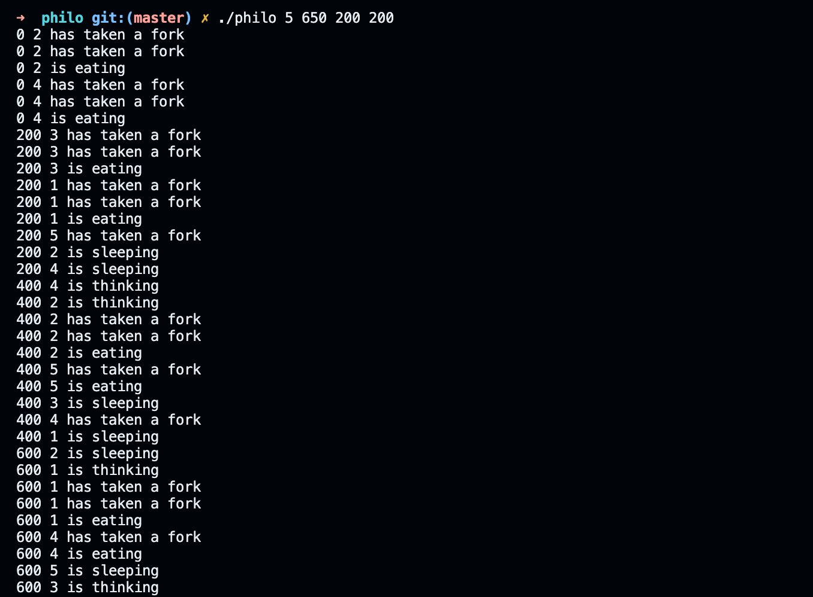

# philosophers
Philosophers is a project which makes use of multithreading using the pthread library in C. Each philosopher represents a thread. The difficulity of this project is that the forks are a shared resource. You need to make sure the philosophers don't get in a deadlock situation where everone is waiting for a fork and no one makes progress.

## the rules
* There are number_of_philosophers at a table. They al need to eat sleep and think to survive.    
* There are as many forks as there are philosophers.  
* A philosopher needs to have two forks to eat.  
* After a philosopher finishes eating he starts to sleep.  

## how to run
To run philosophers clone the repository and run `make`  

Run `./philo` with the following arguments:
* number_of_philosophers
* time_to_die (in ms)
* time_to_eat (in ms)
* time_to_sleep (in ms)
* (optional) number_of_times_each_philosopher_must_eat

